# Hadestown Booth
An immersive attraction created for CMU's 2026 Spring Carnival.

## Overview
This repository contains the systems developed for a cooperative rhythm game experience within our Hadestown booth, designed to synchronize inputs from Arduino controllers and an infrared webcam with animatronic flowers, lights, and music. It was developed by members of CMU's Theme Park Engineering Group, as part of a larger booth collaboration with CMU's Sustainable Earth and American Society of Civil Engineers. This booth won first place in the Blitz category.

The final project installation was a reduced version of the original concept, and not every system in this repository was integrated into the final attraction.

## Features
* Infrared Tracking
  * Uses an infrared webcam and OpenCV to detect a custom-made wand
* Animatronic flowers
 * Seven custom-built animatronic flowers with individually controllable petals and programmable LEDs
* Show Control
  * Uses Art-Net and QLC+ to trigger DMX lighting cues
* Guitar and Lyre Controllers
  * Two Arduino-powered controllers that communicate with Unity over serial
* Finite State Machine (incomplete)
  * Intended to manage game state and communicate with controllers, webcam, and lights
* Music
  * Custom music and charting

## System Design
The game was designed as a cooperative rhythm game for two to three players.

On one wall, the conductor would play a Simon-style minigame, using a wand to play notes signaled by the LED lights on an animatronic flower. On the opposite wall, players would use the guitar and lyre controllers to play a Guitar Hero-style minigame, strumming notes according to the lights on a circular ring of animatronic flowers. 

As the players progressed, the animatronic flowers would bloom or die (depending on the overall score), and the music and lights would update accordingly. Depending on the team's performance, a final show sequence would play before guests exit through one of two ending hallways.

This is a sketch of the planned layout of the attraction's major components.
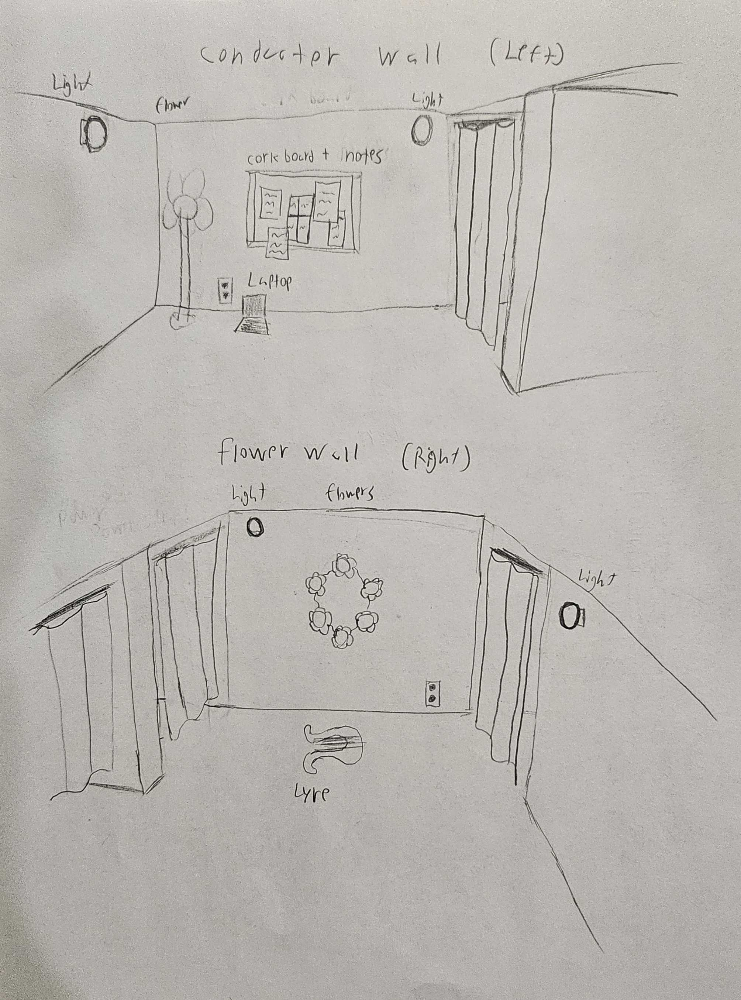

The Finite State Machine was intended to update the game state as the players progress and trigger lighting and sound effects.

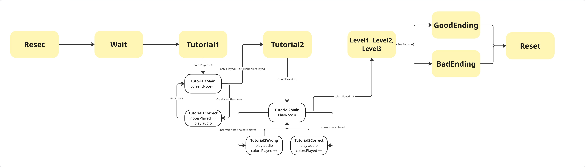
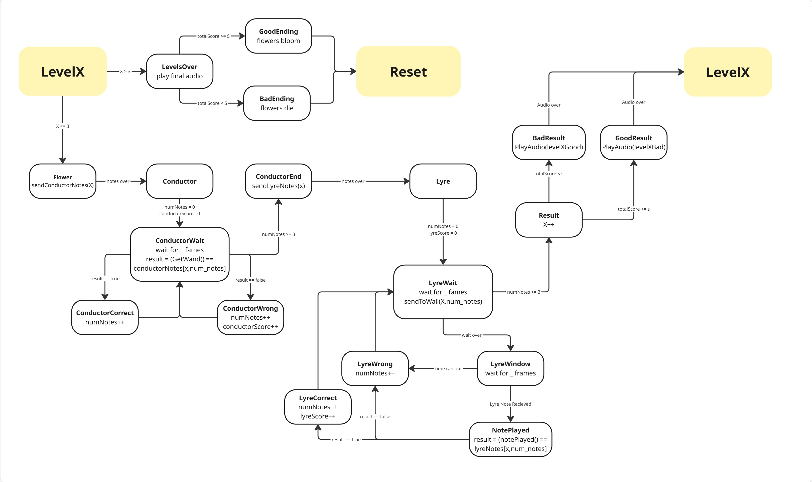

In our final installation system, a ride operator used keyboard controls to dynamically update the lights and animatronics to mimic the intended gameplay. Each of the individual systems functioned independently during development, but the full integration of these systems with the planned finite state machine was not completed before the booth opened. As a result, we switched to a B Mode with manual ride operator control.

This is the wall where the conductor would use a wand to play notes indicated by LED lights in the standalone animatronic flower. The infrared webcam is hidden in the center of the corkboard. This setup worked well in a dark room, but struggled when outside light leaked into our booth.
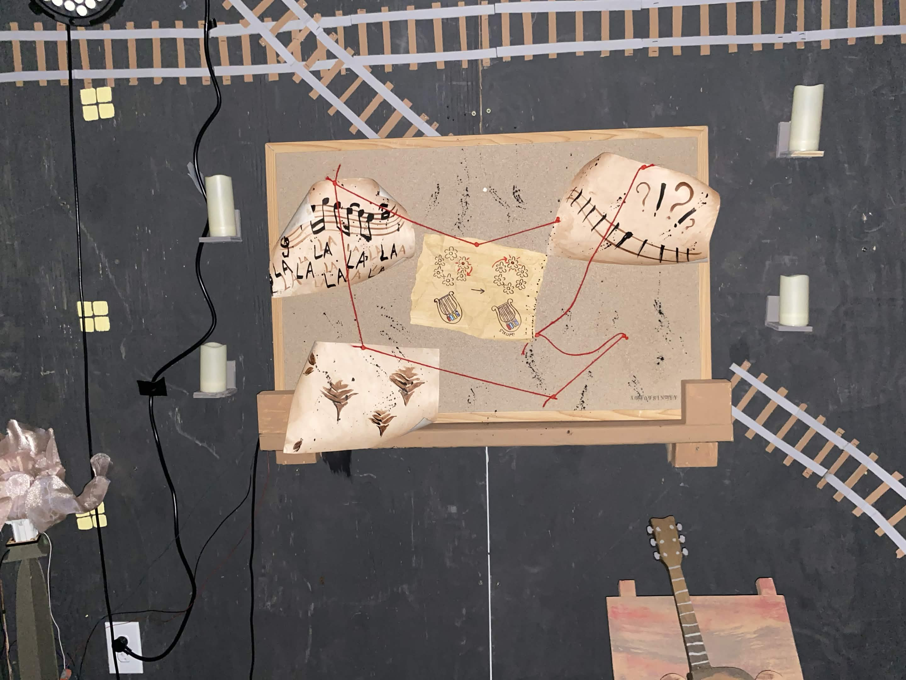
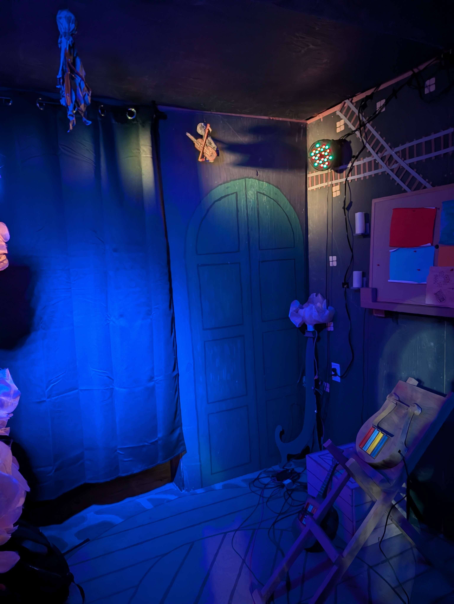

This is the wall where the players would strum notes indicated by lights in the circular wall of animatronic flowers.
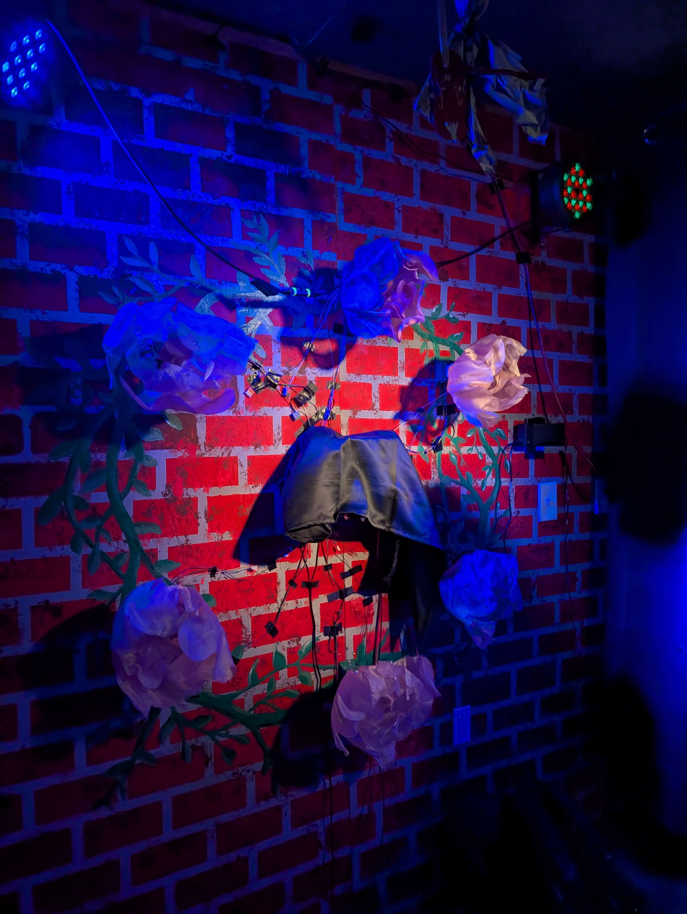

These are the guitar and lyre controllers.
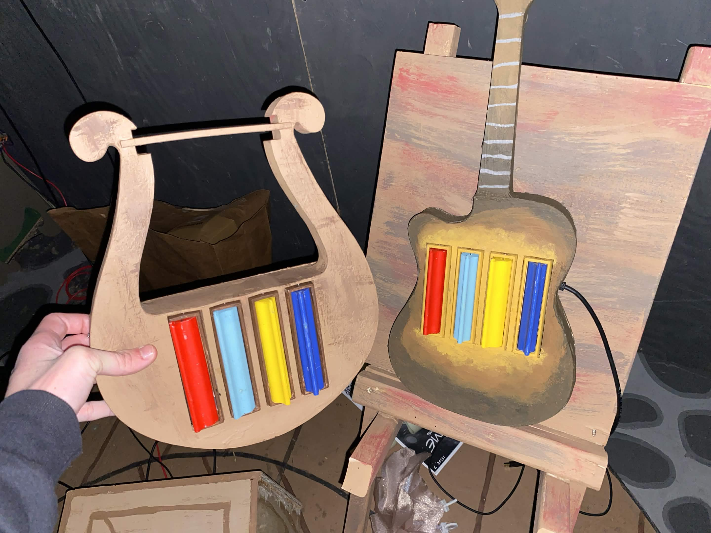

For more information on the Arduino components of our booth, check out the `ArduinoMain` branch Readme (WIP).

This is the electrical diagram, indicating the placement of wires and outlets within the walls of our booth.

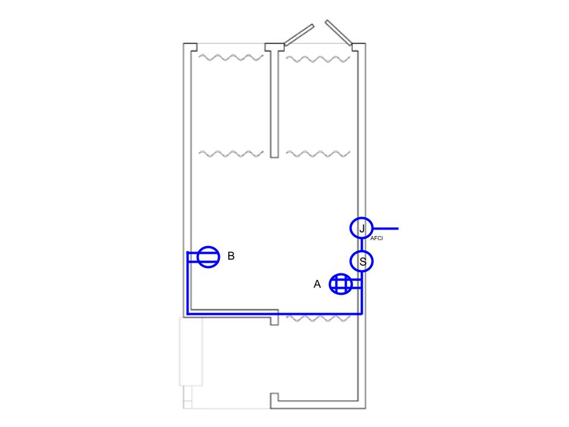
Legend:
J - AFCI receptacle
S - switch
A - quadplex outlet
B - duplex outlet

The booth featured four LED Par lights, all mounted within the central room. Cues were sent from Unity to QLC+ via Art-Net, then routed to an ENTTEC Open DMX USB Interface, then daisy-chained across the fixtures using 3-pin DMX. Each fixture was independently connected to power. This is the patch sheet for these lights.
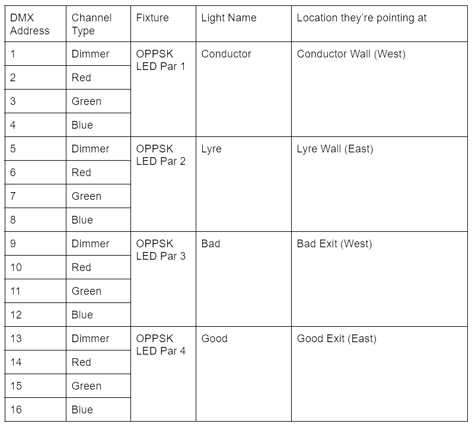

## Repository Structure
| Branch/Path                   | Contents                                               |
|-------------------------------|--------------------------------------------------------|
| `main/README`                 | This file                                              |
| `AnimatronicMain/Animatronic` | Scripts for Animatronic Flowers                        |
| `GameMain/Game`               | Unity program, Infrared Tracking, FSM, Lighting, Music |
| `bmode/Game`                  | Controls for manual operation                          |

## Setup
Lighting control
* Checkout the `GameMain` branch
* Use Unity 6000.3.9f1
* Make sure the lights are addressed according to the patch sheet and QLC+ is configured to receive Art-Net signals over `localhost` (`127.0.0.1`)
* Press play!

Keyboard Controls (lighting effects)
| Key | Cue             |
|-----|-----------------|
| `b` | Blackout        |
| `w` | Wait for guests |
| `g` | Good Ending     |
| `e` | Bad Ending      |
| `0` | State 0         |
| `1` | State 1         |
| `2` | State 2         |
| `3` | State 3         |

States 0-3 represent varying levels of simulated player progress, from 0 (worst) to 3 (best).

Flower controls
* Checkout the `bmode` branch
* Use Unity 6000.3.9f1
* Navigate to the `ArduinoTest` scene
* Make sure the flower wall's COM port and baud rate match its respective `SerialControllers` object
* Press play!

Keyboard Controls (Flower Wall)
| Key | Effect                                         |
|-----|------------------------------------------------|
| `r` | Send one red note to the flower wall           |
| `b` | Send one blue note to the flower wall          |
| `y` | Send one yellow note to the flower wall        |
| `c` | Send one cyan note to the flower wall          |
| `u` | Sets all flowers to position 1 (almost closed) |
| `d` | Sets all flowers to position 5 (almost open)   |
| `o` | Increases flower position by 1                 |
| `p` | Decreases flower position by 1                 |

Flower positions range from 0 to 6 (inclusive). Going further than this could damage the flower mechanism.

## Media
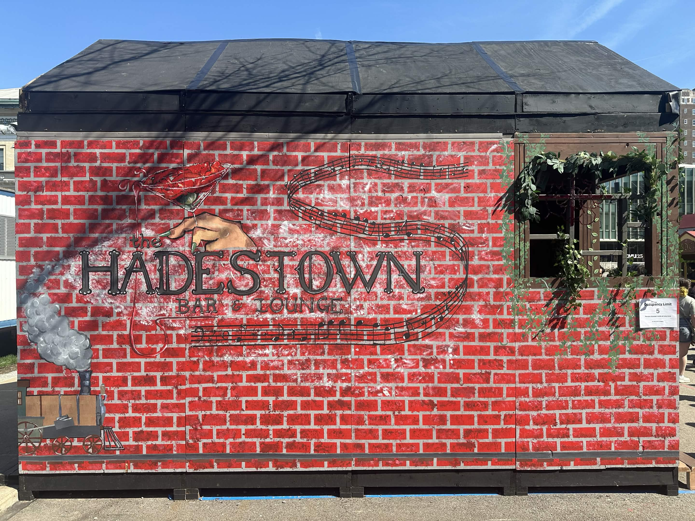
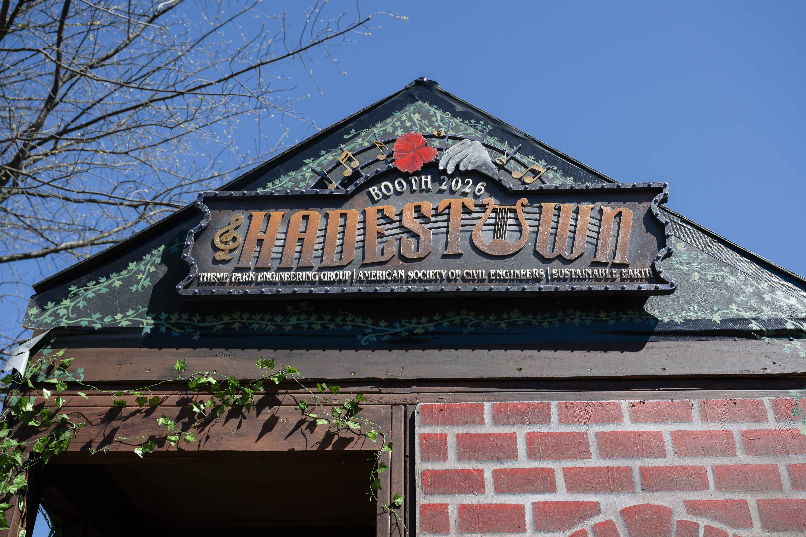
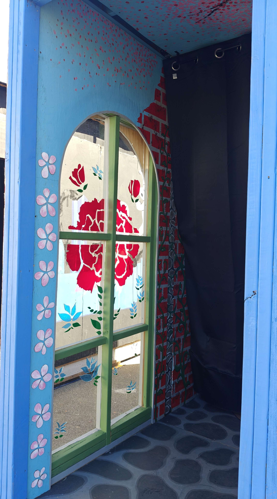
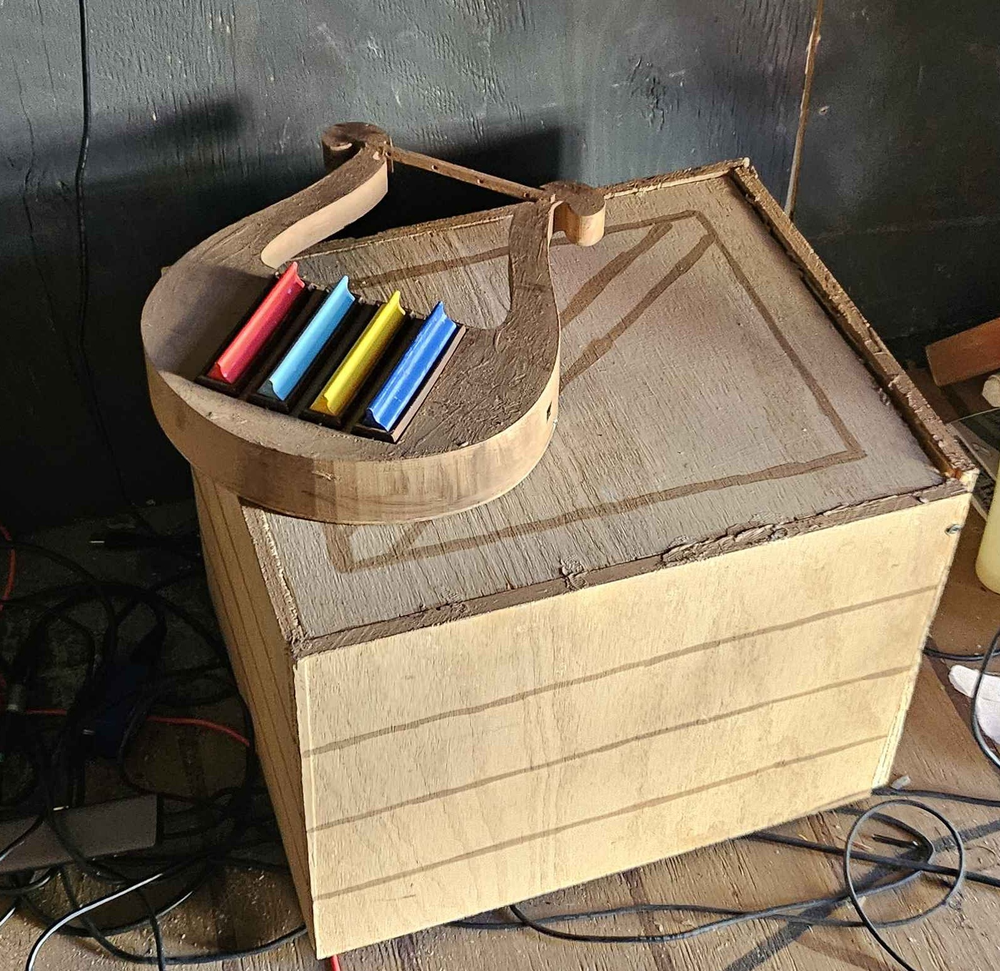
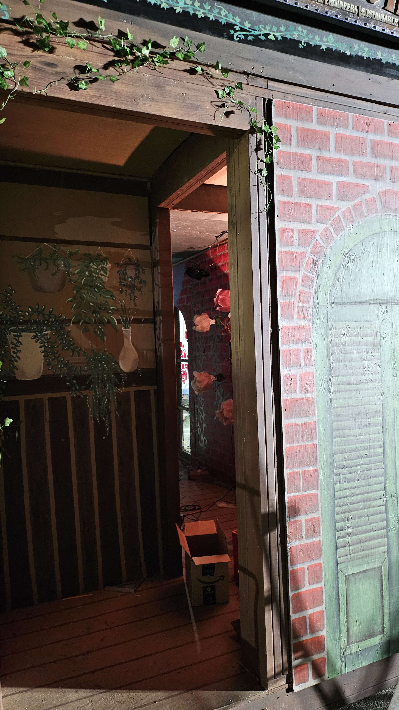

## Contributions
Project Leadership
* Game Chair - Taylor Roberts
* Animatronics Chair - Maci Hanneken

Game and Unity
* Finite State Machine - Taylor Roberts, Ben Morris
* Infrared Tracking - Ben Morris, Jacob Yakubisin, Deanna Paukstitus
* Lighting Control - Taylor Roberts
* Lyre and Guitar Controllers - Tay Padilla
* Music and Charting - Kenechukwu Echezona

Animatronics
* Design and Fabrication - Maci Hanneken
* Programming and Control - Jacob Yakubisin
* Fabrication - Stellan Sarduy

Electrical
* Design - Taylor Roberts
* Installation - Taylor Roberts, Jacob Yakubisin, Tay Padilla

Lighting
* Design, Programming, Installation, Testing - Taylor Roberts
* Consultation - Cyril Neff, Sunaina Singh

Operations
* Ride Operators - Taylor Roberts, Jacob Yakubisin, Maci Hanneken, Ben Morris, Kenechukwu Echezona, Deanna Paukstitus

The 2026 Theme Park Engineering Group, Sustainable Earth, and American Society of Civil Engineers Booth Team
* Samhita Gudapati - Logistics Chair
* Stefan Orbovich, Nurshinta Berry - Structural and Construction Chairs
* Julian Cheung, Isabella Williams - Paint Chairs
* Liav Soued - Design Chair
* Taylor Roberts - Head Chair, Game Chair, and Electrical Chair
* Maci Hanneken - Animatronics Chair
* Elina Lee - Props Chair

## Libraries and Technologies
* Stepper by Arduino
* Unity
* Ardity
* [ArtNet.Unity](https://github.com/sugi-cho/ArtNet.Unity/tree/master) (modified)
* OpenCV (not included, install a compatible Unity OpenCV library and place in the assets folder for the infrared tracking system to work)
* QLC+

